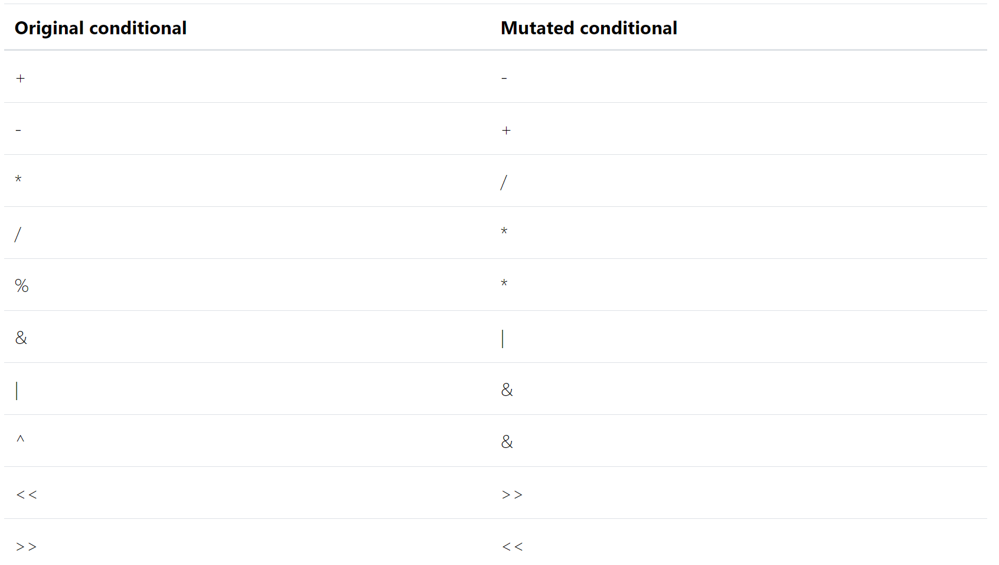

# CS453 Assignment 3: Mutation Testing Tool  for Python

With this assignment, we will try implementing a basic mutation testing tool for Python that can mutate the source code, run given `pytest` test suites, report changed behaviour, and generate kill matrices. The skeleton code, called `pmut.py`, specifies the required functionalities. Assume that the project you want to apply mutation testing to is scored under directory `examples/example1`. When you invoke `pmut.py` as follows:

```bash
$ python3 pmut.py --action mutate --source examples/example1 --mutants ./mutation_diffs --kill ./kill_matrix
```

it should apply mutation operators to all files under `examples/example1`, one mutation to one location in one file at a time, and generate mutants under `./mutated_versions`. You should generate each mutant as a diff against the original program, so that you can get the mutated version when you apply the patch from the root directory of the original project. Each diff file should be named using the following naming convention:

```
[mutation_operator]_[target_filename]_[line_number]_[index].diff
```
**If a mutation operator can generate multiple mutants from the same line in the same file**, sort the mutated line alphabetically and index them from 0 (use two digits, e.g., 00, 01, 02...). If there is only a single mutant, the index is naturally 0.

## Mutation Operators

You should implement the following mutation operators at the minimum:

### Conditionals Boundary Mutator (CONDITIONALS_BOUNDARY)

Operator replaces relational operators according to the table below:


For example:
```
#example.py

def foo(a, b, c):
    if (a < b):
        return a
    if (b > c):
        return b
```

should yield following diffs:

example_CONDITIONALS_BOUNDARY_2_00.diff:\
`-  if(a < b):`\
`+  if(a <= b):`

example_CONDITIONALS_BOUNDARY_4_00.diff:\
`-  if(b > c):`\
`+  if(b >= c):`

### Increments Mutator (INCREMENTS)

Operator replaces assignment increments with assignment decrements and vice versa.

For example:
```
#example1.py

def foo(a):
    x = 3
    for i in range(a):
        x += 3
```

should yield following diffs:

example1_INCREMENTS_4_00.diff:\
`-      x += 3`\
`+      x -= 3`

### Invert Negatives Mutator (INVERT_NEGS)

Operator inverts unary negations.

For example:
```
#example2.py

def foo(a, b):
    x = -3 + 4 * (a - b)
    return x
```

should yield following diffs:

example2_INVERT_NEGS_2_00.diff:\
`-  x = -3 + 4 * (a - b)`\
`+  x = 3 + 4 * (a - b)`

### Math Mutator (MATH)

Operator replaces binary arithmetic operators according to the table below:


For example:
```
#example2.py

def foo(a, b):
    x = -3 + 4 * (a - b)
    return x
```

should yield following diffs:

example2_MATH_2_00.diff:\
`-  x = -3 + 4 * (a - b)`\
`+  x = -3 - 4 * (a - b)`

example2_MATH_2_01.diff:\
`-  x = -3 + 4 * (a - b)`\
`+  x = -3 + 4 / (a - b)`

example2_MATH_2_02.diff:\
`-  x = -3 + 4 * (a - b)`\
`+  x = -3 + 4 * (a + b)`

### Negate Conditionals Mutator (NEGATE_CONDITIONALS)

Operator should replace all conditionals according to the table below:


For example:
```
#example.py

def foo(a, b, c):
    if (a < b):
        return a
    if (b > c):
        return b
```

should yield following diffs:

example_NEGATE_CONDITIONALS_2_00.diff:\
`-  if(a < b):`\
`+  if(a >= b):`

example_NEAGTE_CONDITIONALS_4_00.diff:\
`-  if(b > c):`\
`+  if(b <= c):`

### False returns Mutator (FALSE_RETURNS)

Operator should replace return values with `False`.

For example:
```
#example.py

def foo(a, b, c):
    if (a < b):
        return a
    if (b > c):
        return b
```

should yield following diffs:

example_FALSE_RETURNS_3_00.diff:\
`-      return a`\
`+      return False`

example_FALSE_RETURNS_5_00.diff:\
`-      return b`\
`+      return False`


### True returns Mutator (TRUE_RETURNS)

Operator should replace return values with `True`.

For example:
```
#example.py

def foo(a, b, c):
    if (a < b):
        return a
    if (b > c):
        return b
```

should yield following diffs:

example_TRUE_RETURNS_3_00.diff:\
`-      return a`\
`+      return True`

example_TRUE_RETURNS_5_00.diff:\
`-      return b`\
`+      return True`

### Null returns Mutator (NULL_RETURNS)

Operator should replace return values with `None`.

For example:
```
#example.py

def foo(a, b, c):
    if (a < b):
        return a
    if (b > c):
        return b
```

should yield following diffs:

example_NULL_RETURNS_3_00.diff:\
`-      return a`\
`+      return None`

example_NULL_RETURNS_5_00.diff:\
`-      return b`\
`+      return None`

### Bitwise Operator Mutator (OBBN)

Operator consists of three sub-mutators OBBN1, OBBN2, and OBBN3 that respectively reverse bitwise operators, replace a bitwise operation by its first member, and by its second member.

For example:
```
example3.py

def foo(a, b):
    return a & b
```

should yield following diffs:

example3_OBBN1_2_00.diff:\
`-  return a & b`\
`+  return a | b`

example3_OBBN2_2_00.diff:\
`-  return a & b`\
`+  return a`

example3_OBBN3_2_00.diff:\
`-  return a & b`\
`+  return b`

### Constant Replacement Mutator (CRCR)

Operator mutates inline constant. The mutator is composed of 6 sub-mutators (CRCR1 to CRCR6) that mutate constants according to the table below.


For example:
```
#example1.py

def foo(a):
    x = 3
    for i in range(a):
        x += 3
```

should yield following diffs:

example1_CRCR1_2_00.diff:\
`-  x = 3`\
`+  x = 1`

example1_CRCR2_2_00.diff:\
`-  x = 3`\
`+  x = 0`

example1_CRCR3_2_00.diff:\
`-  x = 3`\
`+  x = -1`

example1_CRCR4_2_00.diff:\
`-  x = 3`\
`+  x = -3`

example1_CRCR5_2_00.diff:\
`-  x = 3`\
`+  x = 3 + 1`

example1_CRCR6_2_00.diff:\
`-  x = 3`\
`+  x = c - 1`


## Skeleton and Test Code

This repository includes a skeleton code named `pmut.py` for your profiler. Please keep the existing code and the command line interface provided, so that GitHub Classroom can run the automated grading scripts. 

The tool should operate in two different action modes, which is specified by the parameter `action`. It can be either `mutate`, or `execute`.

1. Mutation mode (`--action = mutate`)

```bash
$ python pmut.py --action mutate --source [source directory] --mutants [mutation diff directory]
Total number of mutated files: XXX
Total number of mutants generated: XXX
$ 
```
The tool should mutate whatever it finds under the source directory, and create the resulting mutation diff patches under the mutation diff directory: use the naming convention specified above. After mutation, the tool should report the number of mutants generated.


2. Execution mode (`--action = execute`)
```bash
$ python pmut.py --action execute --source [source directory] --mutants [mutation diff directory] --kill [kill matrix directory]
Total test functions found: XXX
Total killed mutants: XXX
Mutation Score: XX.XX% (XX / XX)
```
The tool should read all diffs in mutation diff directory one by one, apply the mutation to the source directory, execute the `pytest` test cases in the source directory one by one, and write the output to the kill matrix directory. It should also print out three lines of information about mutant executions: total test functions, total killed mutants, and the mutation score, down to two digits below decimal point.

In the kill matrix directory, there should be three files:

- Test Case Index File (`test_index.json`): this file should contain the dictionary of test case name to kill matrix row index. Use `[test function name]@[pytest file name without .py]` naming convention for dictionary keys.
- Mutant Index File (`mutation_index.json`): this file should contain the dictionary of mutant name to kill matrix column Index. Use the same mutant naming sonvention for dictionary keys.
- Kill Matrix File (`kill_matrix.np`): this file should be a `numpy` array of type `int32`, whose size is [number of test cases] by [number of mutants]. The array should be saved using [`savetxt`](https://numpy.org/doc/stable/reference/generated/numpy.savetxt.html#numpy.savetxt) function in `numpy`: 1 corresponds to the corresponding mutant (column index) killed by the corresponding test case (row index), and 0 otherwise.

Note that a mutant is killed if 1) the test outcome is different, or 2) the `stdout` or the `stderr` output is different, between the original and the mutated version. **At the end of the execution, the source directory should be reverted back to the original state.**

## Libraries and Python Version

The template repository is configured with Python 3.9. We will use numpy to write the kill matrix.

## Submission Deadline

You need to submit this assignment before **18:00 on 26th of May, 2021.**
